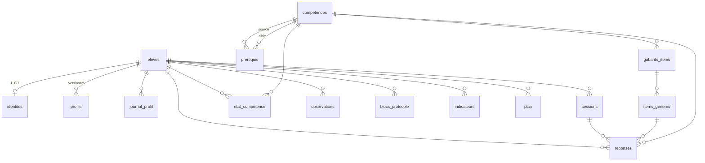

# Livrable 2 — Schéma de données

Conventions : identifiants en anglais ; **libellés en français** ; une seule base relationnelle ;
contenu global versionné **sans** `eleve_id`, tables d'instance **avec** `eleve_id` (cf. P1).

## Diagramme entité-relation



## DDL SQL (compatible SQLite et PostgreSQL)

```sql
-- ============================================================
-- Contenu global (versionné sous Git, PAS par élève)
-- ============================================================

CREATE TABLE competences (
    id            TEXT PRIMARY KEY,          -- ex. 'ALG.EQ1.01'
    domaine       TEXT NOT NULL,             -- NUM PRO ALG GEO ESP FON STA LOG
    chapitre      TEXT NOT NULL,
    intitule      TEXT NOT NULL,
    niveau_ref    TEXT NOT NULL,             -- ex. '5e', '4e', 'seconde'
    difficulte    INTEGER NOT NULL CHECK (difficulte BETWEEN 1 AND 5),
    type          TEXT NOT NULL CHECK (type IN ('procedure','concept','modelisation','raisonnement')),
    seuil_maitrise JSON,                     -- override optionnel du seuil global
    erreurs_types JSON,                      -- erreurs classées possibles
    meta          JSON
);

CREATE TABLE prerequis (
    id         INTEGER PRIMARY KEY,
    source_id  TEXT NOT NULL REFERENCES competences(id),  -- le prérequis
    cible_id   TEXT NOT NULL REFERENCES competences(id),  -- le nœud qui l'exige
    type_arete TEXT NOT NULL DEFAULT 'dure' CHECK (type_arete IN ('dure','faible')),
    UNIQUE (source_id, cible_id)
);

CREATE TABLE gabarits_items (
    id            TEXT PRIMARY KEY,          -- ex. 'ALG.EQ1.01.i1'
    competence_id TEXT NOT NULL REFERENCES competences(id),
    type          TEXT NOT NULL,             -- nom de la fonction génératrice (moteur)
    difficulte    INTEGER NOT NULL CHECK (difficulte BETWEEN 1 AND 5),
    format_reponse TEXT NOT NULL,            -- nombre | entier | fraction | expression | qcm
    enonce        TEXT NOT NULL,             -- template avec variables ${...}
    variables     JSON NOT NULL,             -- variables bornées
    reponse       TEXT NOT NULL,             -- expression sympy de la réponse
    methode       TEXT,                      -- procédure attendue (traçage, cf. P2)
    meta          JSON
);

CREATE TABLE items_generes (
    id               INTEGER PRIMARY KEY,
    gabarit_id       TEXT NOT NULL REFERENCES gabarits_items(id),
    variables        JSON NOT NULL,          -- valeurs tirées
    seed             INTEGER NOT NULL,       -- reproductibilité
    enonce           TEXT NOT NULL,
    reponse_attendue TEXT NOT NULL,          -- canonique, calculée par sympy
    date_generation  TIMESTAMP NOT NULL
);

-- ============================================================
-- Instances par élève
-- ============================================================

CREATE TABLE eleves (
    id            INTEGER PRIMARY KEY,
    pseudonyme    TEXT NOT NULL UNIQUE,
    statut        TEXT NOT NULL DEFAULT 'actif' CHECK (statut IN ('actif','archive','supprime')),
    date_creation TIMESTAMP NOT NULL
);

CREATE TABLE identites (                     -- données identifiantes, SÉPARÉES (RGPD)
    id               INTEGER PRIMARY KEY,
    eleve_id         INTEGER NOT NULL UNIQUE REFERENCES eleves(id),
    nom              TEXT,
    prenom           TEXT,
    date_naissance   DATE,
    contact_famille  TEXT,
    consentement     BOOLEAN,
    date_consentement DATE
);

CREATE TABLE profils (                       -- versionné
    id          INTEGER PRIMARY KEY,
    eleve_id    INTEGER NOT NULL REFERENCES eleves(id),
    version     INTEGER NOT NULL,
    date_version TIMESTAMP NOT NULL,
    raison      TEXT,
    champs      JSON NOT NULL,               -- {champ: valeur}
    statuts     JSON NOT NULL,               -- {champ: 'D'|'M'|'H'}
    UNIQUE (eleve_id, version)
);

CREATE TABLE journal_profil (
    id              INTEGER PRIMARY KEY,
    eleve_id        INTEGER NOT NULL REFERENCES eleves(id),
    version         INTEGER NOT NULL,
    champ           TEXT NOT NULL,
    ancienne_valeur TEXT,
    nouvelle_valeur TEXT,
    statut          TEXT NOT NULL CHECK (statut IN ('D','M','H')),
    raison          TEXT,
    date            TIMESTAMP NOT NULL
);

CREATE TABLE sessions (
    id         INTEGER PRIMARY KEY,
    eleve_id   INTEGER NOT NULL REFERENCES eleves(id),
    date_debut TIMESTAMP NOT NULL,
    date_fin   TIMESTAMP,
    type       TEXT NOT NULL CHECK (type IN ('entretien','test_adaptatif','seance','protocole_D')),
    notes      TEXT
);

CREATE TABLE reponses (                      -- événements BRUTS, jamais modifiés
    id               INTEGER PRIMARY KEY,
    eleve_id         INTEGER NOT NULL REFERENCES eleves(id),
    session_id       INTEGER REFERENCES sessions(id),
    item_id          INTEGER REFERENCES items_generes(id),
    competence_id    TEXT REFERENCES competences(id),
    reponse_eleve    TEXT,                   -- brute, telle que saisie
    est_correct      BOOLEAN,                -- verdict immédiat (recalculable via item)
    temps_reponse_ms INTEGER,
    confiance_annoncee INTEGER,              -- 1..5, nullable
    type_erreur      TEXT CHECK (type_erreur IN ('etourderie','procedure','concept','lacune')),
    methode_observee TEXT,                   -- traçage de méthode (P2)
    date             TIMESTAMP NOT NULL
);

CREATE TABLE etat_competence (               -- état DÉRIVÉ, régénérable
    id                 INTEGER PRIMARY KEY,
    eleve_id           INTEGER NOT NULL REFERENCES eleves(id),
    competence_id      TEXT NOT NULL REFERENCES competences(id),
    statut             TEXT NOT NULL CHECK (statut IN ('absent','fragile','acquis','consolide')),
    origine            TEXT NOT NULL CHECK (origine IN ('mesure','propagation','controle')),
    nb_reussites       INTEGER NOT NULL DEFAULT 0,
    nb_tentatives      INTEGER NOT NULL DEFAULT 0,
    derniere_date      DATE,
    date_acquisition   DATE,
    date_consolidation DATE,
    UNIQUE (eleve_id, competence_id)
);

CREATE TABLE observations (                  -- grille module A bloc 7
    id         INTEGER PRIMARY KEY,
    eleve_id   INTEGER NOT NULL REFERENCES eleves(id),
    session_id INTEGER REFERENCES sessions(id),
    type       TEXT NOT NULL,                -- latence, abandon, autocorrection, ...
    valeur     JSON,
    date       TIMESTAMP NOT NULL
);

CREATE TABLE blocs_protocole (               -- module D
    id         INTEGER PRIMARY KEY,
    eleve_id   INTEGER NOT NULL REFERENCES eleves(id),
    cycle      INTEGER NOT NULL,
    notion     TEXT NOT NULL,
    condition  TEXT NOT NULL CHECK (condition IN ('V','S','C','M')),
    ordre      INTEGER NOT NULL,             -- position dans le carré latin
    dates      JSON,                         -- J0, J+2, J+4, J+7, J+9
    mesures    JSON,                         -- pre, T0, T2, T7, temps, effort, plaisir, ...
    fidelite   JSON,                         -- fiche de fidélité (5 cases)
    statut     TEXT NOT NULL DEFAULT 'planifie' CHECK (statut IN ('planifie','en_cours','termine','exclu'))
);

CREATE TABLE indicateurs (                   -- dérivés, recalculables
    id          INTEGER PRIMARY KEY,
    eleve_id    INTEGER NOT NULL REFERENCES eleves(id),
    nom         TEXT NOT NULL,               -- ex. 'taux_reussite_NUM'
    valeur      JSON NOT NULL,
    periode     TEXT NOT NULL DEFAULT 'global',
    date_calcul TIMESTAMP NOT NULL
);

CREATE TABLE plan (                          -- plan de progression
    id             INTEGER PRIMARY KEY,
    eleve_id       INTEGER NOT NULL REFERENCES eleves(id),
    version        INTEGER NOT NULL,
    date_creation  TIMESTAMP NOT NULL,
    cible_noeuds   JSON NOT NULL,            -- nœuds cibles
    noeuds_ordonnes JSON NOT NULL,           -- ordre de travail
    echeances      JSON,                     -- {noeud: date}
    statut         TEXT NOT NULL DEFAULT 'actif' CHECK (statut IN ('actif','archive')),
    UNIQUE (eleve_id, version)
);

-- Index
CREATE INDEX idx_reponses_eleve       ON reponses (eleve_id, date);
CREATE INDEX idx_reponses_competence  ON reponses (eleve_id, competence_id);
CREATE INDEX idx_etat_competence_eleve ON etat_competence (eleve_id);
CREATE INDEX idx_prerequis_cible      ON prerequis (cible_id);
```

## Notes de portabilité SQLite → PostgreSQL

- Aucune fonctionnalité SQLite-only : pas d'`AUTOINCREMENT`, pas de `SERIAL`, pas de `IF NOT EXISTS` spécifique.
- `JSON` est supporté nativement par les deux (SQLite 3.38+, PostgreSQL 9.4+).
- `TEXT` en PK : OK des deux côtés.
- La migration se limite à l'URL de connexion + une passe Alembic sur les types entiers.
